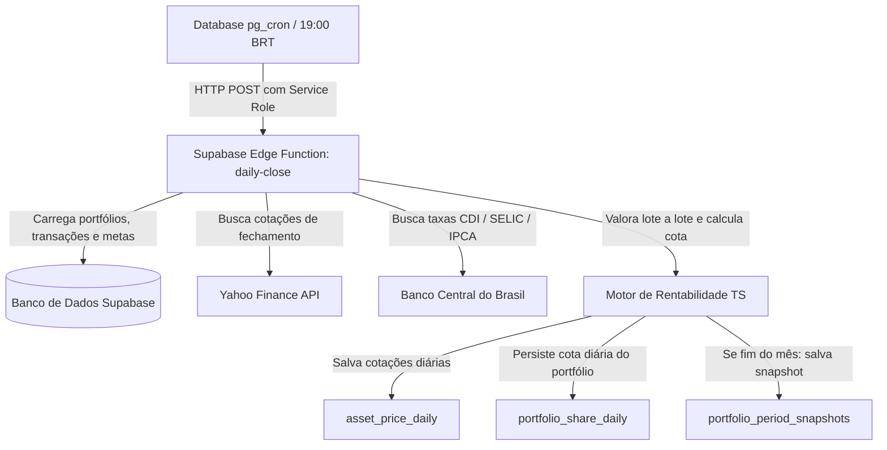

# Plano de Implementação: Fechamento Diário Automatizado no Backend (Supabase Edge Functions + pg_cron)

Este plano descreve como desacoplar a lógica de fechamento diário de investimentos do navegador e movê-la inteiramente para o backend. Isso garantirá que o fechamento ocorra pontualmente todas as noites (às 18h/19h BRT) de forma 100% autônoma, populando a tabela `portfolio_share_daily` e recalculando as cotas com alta precisão matemática, sem depender da abertura do app pelo usuário.

---

## Perguntas para Alinhamento (Open Questions)

Para garantir que a integração atenda perfeitamente ao seu ecossistema, responda às seguintes perguntas:

> [!IMPORTANT]
> **1. Ambiente do Supabase (Cloud vs. Local/Docker):** Seu projeto do Supabase está rodando na nuvem (Supabase Cloud) ou localmente em containers Docker? Se estiver na nuvem, o agendamento via `pg_cron` usará o host HTTP da nuvem; se for local, usaremos `http://kong:8000/functions/v1/daily-close`.
>
> **2. Horário do Cron Job:** Propomos rodar o cron job de fechamento diariamente às **22:00 UTC** (19:00 no horário de Brasília), pois a B3 e o Banco Central (BCB) já terão divulgado todas as cotações e taxas diárias de fechamento. Esse horário atende bem, ou prefere outro?
>
> **3. Fonte das Cotações no Backend:** A Edge Function consultará diretamente o Yahoo Finance para ações, FIIs e criptoativos (reutilizando a lógica resiliente com tratamento de Spikes que já criamos no frontend). Para títulos de Renda Fixa (CDI/SELIC/IPCA e Tesouro), a Edge Function consultará a API do Banco Central (SGS). Está de acordo com essa arquitetura híbrida de dados?
>
> **4. Abordagem de Deploy:** Deseja que eu crie os scripts e arquivos necessários na pasta `supabase/functions/daily-close` e na pasta de migrations (`supabase/migrations/`) para configurar a extensão `pg_cron` e o agendamento SQL, para que você execute o comando `supabase functions deploy`?

---

## Arquitetura Proposta

O fluxo funcionará da seguinte maneira:

### Componentes Técnicos

1. **Supabase Edge Function (`daily-close`):**
   * Desenvolvida em TypeScript para rodar no Deno (runtime nativo do Supabase Edge Functions).
   * Irá ler os portfólios ativos no banco de dados.
   * Fará a requisição assíncrona concorrente à API do Yahoo Finance para cotações de mercado e Banco Central (SGS) para taxas do dia.
   * Executará o motor de cálculo (lote por lote) para consolidar o patrimônio bruto.
   * Gravará o fechamento diário e atualizará a cota e os preços históricos de fechamento no banco.
   * Se a data de execução for o último dia do mês, criará também o snapshot mensal (`portfolio_period_snapshots`) de rentabilidade TWR.

2. **Agendamento no Banco de Dados (`pg_cron`):**
   * Migração SQL para habilitar a extensão `pg_cron` no Supabase.
   * Agendamento de uma tarefa recorrente que executa um comando HTTP POST chamando a Edge Function com segurança através do cabeçalho de autorização.

---

## Proposta de Alterações

### [Component: Backend Edge Function]

#### [NEW] [index.ts](file:///c:/Users/gabri/OneDrive/Documentos/meusapps/minhas_financas/supabase/functions/daily-close/index.ts)
* Edge Function autônoma escrita em Deno TypeScript.
* Implementa o carregamento de dados via Deno Supabase Client (usando o `service_role_key` configurado na Edge Function).
* Consome APIs externas de cotações e indexadores.
* Processa a lógica de cálculo de cotas diárias e snapshots.

### [Component: Database Schedule]

#### [NEW] [20260618210000_enable_daily_close_cron.sql](file:///c:/Users/gabri/OneDrive/Documentos/meusapps/minhas_financas/supabase/migrations/20260618210000_enable_daily_close_cron.sql)
* Script SQL de migração habilitando `pg_cron`.
* Agendamento automático do fechamento diário ligando o banco de dados diretamente à Edge Function.

### [Component: Frontend Page]

#### [MODIFY] [Investments.tsx](file:///c:/Users/gabri/OneDrive/Documentos/meusapps/minhas_financas/src/pages/Investments.tsx)
* Desativar a rotina automática de fechamento que rodava no `useEffect` (a qual executava `handleDailyClose` e travava o carregamento inicial).
* O frontend passará a ler passivamente os dados de fechamento persistidos pelo backend na tabela `portfolio_share_daily`.

---

## Plano de Verificação

### Testes de Funcionamento Local
* Executar a Edge Function localmente usando o comando:
  `supabase functions serve daily-close --no-verify-jwt`
* Disparar uma chamada HTTP manual via curl/Postman para testar o fechamento instantâneo de um portfólio.
* Verificar se a tabela `portfolio_share_daily` e os preços históricos em `asset_price_daily` foram devidamente populados.

### Monitoramento
* Checar os logs do painel do Supabase (Edge Function Logs e pg_cron logs) para monitorar o sucesso das chamadas recorrentes.
