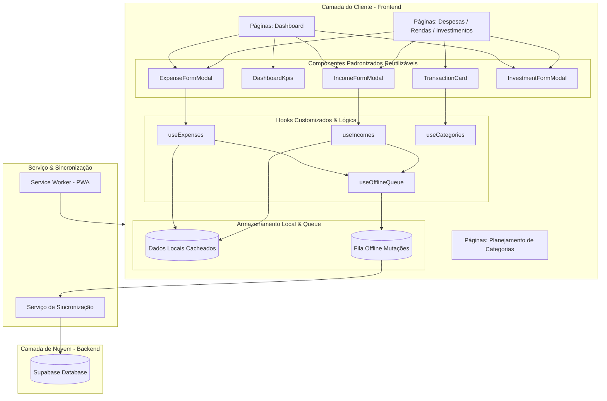

# Arquitetura do Sistema - Minhas Finanças

Este documento descreve detalhadamente a estrutura técnica, os padrões de design e o fluxo de dados da aplicação **Minhas Finanças**. Ele serve como guia de onboarding e de governança técnica para garantir a consistência do ecossistema.

---

## 1. Visão Geral da Arquitetura

O **Minhas Finanças** é uma aplicação **PWA (Progressive Web App)** construída com a stack React 18, TypeScript, Vite e Tailwind CSS, integrada ao Supabase como Backend-as-a-Service (BaaS). A aplicação foi projetada sob o paradigma **Offline-First**, permitindo que todas as mutações e visualizações de dados funcionem sem conexão com a internet.

### Mapa de Fluxo e Componentes (Mermaid Diagram)



---

## 2. Componentes Padronizados (UI/UX Core)

Para evitar redundância e garantir consistência estética extrema (em conformidade com a governança HSL), a interface de usuário foi modularizada em 5 componentes fundamentais em `src/components/`:

1. **`TransactionCard.tsx`**: Unifica a exibição de despesas e rendas. Controla badges de categoria com cor dinâmica, representação de parcelamento (`1/12`), badges de faturas de cartão de crédito e indicador animado de carregamento para IDs `offline-`.
2. **`DashboardKpis.tsx`**: Renderiza a grade padrão de KPIs do Dashboard (Rendas, Despesas, Investimentos e Saldo), com ícones e formatação monetária segura.
3. **`ExpenseFormModal.tsx`**: Gerencia o ciclo completo (cadastro, edição e deleção) de despesas. Inclui lógica de competência de cartões (automática vs manual) e peso de inclusão em relatórios (`report_weight`).
4. **`IncomeFormModal.tsx`**: Gerencia o ciclo de rendas. Trata de forma especial estornos automáticos de cartões de crédito (bloqueando a edição manual para manter a integridade).
5. **`InvestmentFormModal.tsx`**: Formulário simplificado de inclusão e edição de aportes em investimentos.

---

## 3. Estratégia Offline-First (Mutações em Fila)

O aplicativo garante operação contínua mesmo em quedas de sinal de rede:

* **Leitura**: Todas as listagens usam cache do `localStorage` atualizado em segundo plano.
* **Escrita (Fila de Mutações)**:
  1. Quando uma mutação (criar/editar/deletar) ocorre sem conexão, o hook `useOfflineQueue` captura a ação.
  2. A mutação recebe um ID provisório (ex: `offline-1716382103`).
  3. A ação é serializada na tabela local de pendências.
  4. Um evento global `local-data-changed` é disparado, forçando a atualização imediata da interface.
  5. Quando o navegador detecta a volta da internet (evento `online`), o serviço sincroniza a fila executando as operações na ordem cronológica exata no Supabase.

---

## 4. Estrutura de Diretórios Organizada

```text
├── database/                   # Scripts de Banco de Dados
│   ├── database.sql            # Estrutura base completa (Tabelas, Triggers, RLS)
│   ├── schema.sql              # Apenas o schema DDL limpo
│   ├── migrations/             # Migrations de evolução de banco
│   │   └── migration_v3_report_data.sql
│   └── samples/                # Arquivos CSV ou dados de amostra para testes
│       └── Fatura2026-03-15.csv
│
├── docs/                       # Documentações do Projeto
│   ├── ui/                     # Governança visual de Guardrails
│   │   ├── GOVERNANCA_UI.md    # Manual de sobrevivência estética (HSL)
│   │   └── guardrails-baseline.json
│   └── ARCHITECTURE.md         # Este documento
│
├── src/
│   ├── components/             # Componentes de UI Modulares (TransactionCard, Modais, etc.)
│   ├── constants/              # Constantes globais (PAGE_HEADERS, cores)
│   ├── contexts/               # Provedores de Tema, Paleta de Cores e Autenticação
│   ├── hooks/                  # Integração com Banco (useExpenses, useIncomes, useCategories)
│   ├── pages/                  # Páginas principais limpas e roteadas
│   ├── services/               # Regras de negócios específicas (AI, conciliação)
│   ├── types/                  # Contratos TypeScript de domínio
│   └── utils/                  # Helpers e utilitários matemáticos/datas
```

---

## 5. Governança de Layout & HSL

O sistema de cores do aplicativo é totalmente configurado via variáveis HSL em `src/index.css` e integrado ao `tailwind.config.js`. Para manter a harmonia visual:
* Evite cores sólidas como `bg-red-500` ou `bg-blue-600`.
* Sempre use as classes temáticas: `text-primary`, `bg-secondary`, `border-primary`, `bg-tertiary` ou classes semânticas `text-expense`, `text-income`.
* A conformidade de estilos é verificada a cada commit pelo validador de guardrails (`npm run guardrails:ui`).
