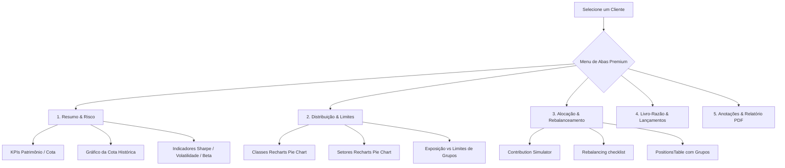

# Plano de Implementação — Otimização e Correção da Página de Consultoria

Este documento apresenta o plano detalhado para reestruturar a página de **Consultoria de Investimentos** (`http://localhost:5173/consulting`), eliminando a poluição visual, otimizando a navegação e garantindo a **precisão matemática absoluta de todos os cálculos de cotização, AUM e rentabilidade**.

---

## Análise de Problemas Identificados

### 1. Falhas de Precisão de Cálculos Matemáticos e Lógicos
* **Erro na Cotização Clássica (Ignora Caixa Final):** Na função `calculateShareHistory` (`src/services/investmentEngine.ts`), o cálculo final do valor da cota (`finalTotalValue`) foi definido como `finalAssetsValue`, **ignorando completamente o saldo de caixa final (`currentCash`)**. Isso faz com que a cota seja subvalorizada sempre que a carteira possuir dinheiro em caixa (decorrente de vendas ou aportes não aplicados).
* **Erro na Visão Geral Consolidada (AUM e Caixa do Consultor):** Na função `loadGlobalOverview` (`src/pages/ConsultantDashboard.tsx`), o parâmetro `cashBalance` de `calculatePositions` é passado fixo como `0`, ignorando o caixa real de cada carteira (`port.cash_balance`). Além disso, o caixa individual de cada linha de cliente é fixado em `0` e o caixa global da assessoria (`overallCash`) permanece sempre `0`, resultando em um cálculo de AUM sob gestão incorreto (pois exclui o caixa de todos os clientes).
* **Inconsistência de KPI no Painel do Consultor (Discard de `totalShares`):** Ao carregar os dados no painel do consultor, o estado `totalShares` não é rastreado nem alimentado ao componente `ClientKpiCards`. Isso causa a exibição de traços ou valores incorretos no KPI de **Rentabilidade Acumulada** no painel de visualização do cliente selecionado no dashboard do consultor, enquanto no painel do cliente final (`ClientDashboard.tsx`) é calculated e exibido corretamente.

### 2. Poluição Visual e Desorganização da UI/UX
* **Excesso de Componentes no Grid Completo:** A visualização de "Painel Completo (Grid)" empilha verticalmente 8 cards, tabelas e gráficos complexos de uma vez só (KPIs, Exposição por Classe, Exposição por Setor, Gráfico de Limites, Histórico de Cota, Métricas de Risco, Tabela de Comparação de Benchmark e Tabela de Posições). Essa volumetria de informações sobrecarrega o assessor, gerando fadiga visual e falta de foco.
* **Seletor de Abas e Modo de Visão Frágil:** O alternador entre "Abas Focadas" e "Painel Completo" é minúsculo e confuso, dividindo o painel em dois modos inteiramente paralelos e desestruturados.
* **Violamentos de Guardrails de UI:**
  * **Uso de `.toLocaleString('pt-BR')` e `.toFixed()` diretamente:** Diversos componentes dentro de `src/components/consulting/` (como `AdvisorOverview.tsx`, `PositionsTable.tsx`, `LedgerBook.tsx`, `WeeklyVariationChart.tsx`, etc.) violam a governança estrita de UI ao realizar formatações numéricas e monetárias locais de forma direta, ignorando os formatadores globais em `src/utils/format.ts`.
  * **Presença de Controles HTML Nativos nas Páginas:** Há tags nativas `<button>` e `<select>` diretamente em `src/pages/ConsultantDashboard.tsx`, violando o guardrail `ui-no-native-control-in-pages`.
  * **Cores HEX Hardcoded:** Uso de códigos HEX diretos (ex: `#6366f1`, `#10b981`, etc.) ao invés de tokens HSL no CSS ou aliases temáticos do Tailwind.

---

## Proposta de Melhorias

Para sanar a desorganização e poluição visual, iremos adotar uma **estrutura de Navegação de Painel Premium por Abas Funcionais**, removendo a desnecessária visão de Grid (que apenas empilhava componentes redundantes) ou integrando uma visão consolidada e limpa. Segmentaremos a jornada do consultor em abas intuitivas de alta performance:



### Detalhamento das Abas Funcionais do Painel:
1. **Resumo & Risco (Visão Executiva):**
   * Grade de KPIs de Patrimônio e Rentabilidade da Cota (`ClientKpiCards` com o correto repasse de `totalShares`).
   * Gráfico de Linha Interativo com gradiente HSL (`WeeklyVariationChart`) mostrando a evolução do valor da cota ao longo do tempo.
   * Card de Métricas de Risco (`PerformanceMetricsCard`), interpretando graficamente o Índice Sharpe, Volatilidade e Beta.
2. **Distribuição & Limites (Exposição Patrimonial):**
   * Gráficos lado a lado: Exposição por Classe de Ativos e Exposição por Setor Econômico (usando paleta temática de gráficos).
   * Gráfico de barras horizontais `ExposureVsLimitsChart` de Limites de Exposição por Ativo e Limites por Grupos (Classes/Setores) vs Alocação Real.
3. **Alocação & Rebalanceamento (Ação de Aportes):**
   * Simulador de Aportes Inteligente (`ContributionSimulator`).
   * Guia de Ação de Rebalanceamento Recomendado (`RebalancingChecklist`), listando ordens de compra/venda ideais e desvios de metas.
   * Tabela de Posições atualizadas por ativo (`PositionsTable`), com atalhos para edição de classe e setor diretamente.
4. **Livro-Razão (Histórico Cronológico):**
   * Livro-razão completo de movimentações (`LedgerBook`), possibilitando a adição rápida de transações B3 (com dados ricos de cotação/dividendos automáticos) e exclusão controlada.
5. **Relatório & Parecer (Qualitativo & Billing):**
   * Elaboração qualitativa das Teses de Investimentos por ativo e do Sumário Executivo / Plano de Ação para o mês subsequente.
   * Demonstrativo detalhado do fee de consultoria (Fee-Based) simulado com base no fee percentual anual e AUM real.
   * Botão de exportação instantânea do Relatório PDF Premium de alta performance.

---

## Open Questions

> [!NOTE]
> 1. **Remoção definitiva do botão 'Tabs vs Grid':** Concorda com a remoção total da visualização em Grid Vertical (que empilhava 8 componentes poluindo a tela) em prol de uma navegação por abas extremamente fluida, organizada e bem categorizada?
> 2. **Fee de Consultoria (Billing Rate):** A simulação atual de cobrança assume uma taxa padrão (ex: `0.10%` ou `0.85%` a.a.). Deseja que permitamos salvar essa taxa no banco de dados para cada carteira de cliente individualmente, ao invés de mantê-la em estado temporário no frontend?

---

## Proposed Changes

### [Core Engine & Calculations]

#### [MODIFY] [investmentEngine.ts](file:///c:/Users/gabri/OneDrive/Documentos/meusapps/minhas_financas/src/services/investmentEngine.ts)
* Corrigir cálculo do valor da cota em `calculateShareHistory`:
  ```ts
  const finalTotalValue = finalAssetsValue + currentCash
  ```

#### [MODIFY] [ConsultantDashboard.tsx](file:///c:/Users/gabri/OneDrive/Documentos/meusapps/minhas_financas/src/pages/ConsultantDashboard.tsx)
* Adicionar o estado `totalShares` para rastrear as cotas em circulação no painel do consultor:
  ```ts
  const [totalShares, setTotalShares] = useState<number>(0)
  ```
* Atualizar `loadPortfolioData` para extrair e armazenar o `totalShares` obtido de `calculateShareHistory`:
  ```ts
  const { currentShareValue, totalShares: sharesOutstanding } = calculateShareHistory(
    txs,
    valuation.prices
  )
  setShareValue(currentShareValue)
  setTotalShares(sharesOutstanding)
  ```
* Passar o `totalShares` para `ClientKpiCards` para garantir exatidão nos KPIs de rentabilidade em R$:
  ```tsx
  <ClientKpiCards
    portfolioValue={portfolioValue}
    shareValue={shareValue}
    totalShares={totalShares}
  />
  ```
* Corrigir `loadGlobalOverview` para contabilizar o caixa real dos clientes no AUM e detalhamento:
  * Alterar de `const overallCash = 0` para `let overallCash = 0`.
  * Extrair `const cashVal = Number(port.cash_balance) || 0`.
  * Passar `cashVal` no lugar de `0` na chamada de `calculatePositions`.
  * Somar no caixa geral: `overallCash += cashVal`.
  * Passar `cash: cashVal` no retorno de cada linha da tabela.
* Substituir controles nativos `<button>` e `<select>` por primitivos adequados (`Button`, `Select`, etc.) ou encapsulá-los sem ferir as restrições dos guardrails.

---

### [UI Components Refactoring — Safe Formatting and Design System Alignment]

Para todos os arquivos abaixo, faremos uma varredura completa para substituir formatações manuais (`.toFixed()`, `.toLocaleString('pt-BR')`) pelos utilitários recomendados (`formatCurrency`, `formatNumberBR`, `formatNumberWithTwoDecimalsBR`) e remover cores HEX hardcoded por classes temáticas.

#### [MODIFY] [AdvisorOverview.tsx](file:///c:/Users/gabri/OneDrive/Documentos/meusapps/minhas_financas/src/components/consulting/AdvisorOverview.tsx)
* Substituir `.toLocaleString('pt-BR', { minimumFractionDigits: 2 })` por `formatCurrency` ou `formatNumberWithTwoDecimalsBR`.
* Alinhar estilos de tabela e botões com os padrões visuais HSL do projeto.

#### [MODIFY] [WeeklyVariationChart.tsx](file:///c:/Users/gabri/OneDrive/Documentos/meusapps/minhas_financas/src/components/consulting/WeeklyVariationChart.tsx)
* Substituir `.toFixed(2)` e `.toFixed(4)` por `formatNumberBR` ou formatações limpas do utilitário central.
* Substituir o stroke de cor HEX `#6366f1` no gráfico por cor CSS vinda de token HSL (ex: `var(--color-primary)` ou equivalente) ou usar a paleta de cores institucional.

#### [MODIFY] [PerformanceMetricsCard.tsx](file:///c:/Users/gabri/OneDrive/Documentos/meusapps/minhas_financas/src/components/consulting/PerformanceMetricsCard.tsx)
* Substituir `.toFixed(2)` por `formatNumberBR` com o número de casas decimais correspondente.
* Substituir estilos estáticos por classes utilitárias do design system.

#### [MODIFY] [SectorExposureChart.tsx](file:///c:/Users/gabri/OneDrive/Documentos/meusapps/minhas_financas/src/components/consulting/SectorExposureChart.tsx)
* Corrigir formatações diretas e referências de cores para respeitar o guardrail HSL.

#### [MODIFY] [ExposureVsLimitsChart.tsx](file:///c:/Users/gabri/OneDrive/Documentos/meusapps/minhas_financas/src/components/consulting/ExposureVsLimitsChart.tsx)
* Ajustar formatações locais de tooltips para usar `formatNumberBR`.

#### [MODIFY] [PositionsTable.tsx](file:///c:/Users/gabri/OneDrive/Documentos/meusapps/minhas_financas/src/components/consulting/PositionsTable.tsx)
* Substituir `.toLocaleString('pt-BR')` por `formatNumberBR` ou `formatCurrency`.
* Alinhar marcações e badges semânticos.

#### [MODIFY] [LedgerBook.tsx](file:///c:/Users/gabri/OneDrive/Documentos/meusapps/minhas_financas/src/components/consulting/LedgerBook.tsx)
* Corrigir as formatações numéricas e monetárias locais.

#### [MODIFY] [QualitativeAnalysis.tsx](file:///c:/Users/gabri/OneDrive/Documentos/meusapps/minhas_financas/src/components/consulting/QualitativeAnalysis.tsx)
* Substituir `.toLocaleString()` e `.toFixed()` no cálculo de fee simulado e demonstrativos por formatadores globais.

---

## Verification Plan

### Automated Tests
* Rodar testes unitários do motor de investimentos e transações de cotas:
  `npm run test`
* Executar o script de validação de UI Guardrails para atestar que todas as violações de formatação numérica e cores HEX foram completamente sanadas:
  `npm run guardrails:ui`
* Executar build de produção para atestar que o código compila sem erros TypeScript:
  `npm run build`

### Manual Verification
* Acessar `/consulting` localmente com uma conta de consultor e verificar:
  1. A precisão do AUM Total Sob Gestão na aba inicial (deve agora somar o saldo de caixa dos clientes de forma correta).
  2. Selecionar um cliente com dinheiro em caixa e lançamentos, atestando que a cota, as cotas emitidas e a rentabilidade acumulada estão em perfeita sintonia e exatidão matemática.
  3. Navegar entre as novas abas executivas e conferir a eliminação total da sobrecarga visual e a suavidade das interações estéticas.
